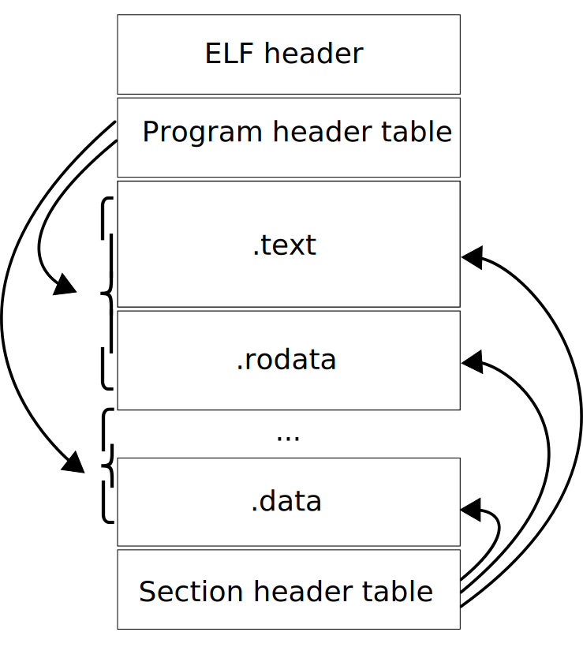
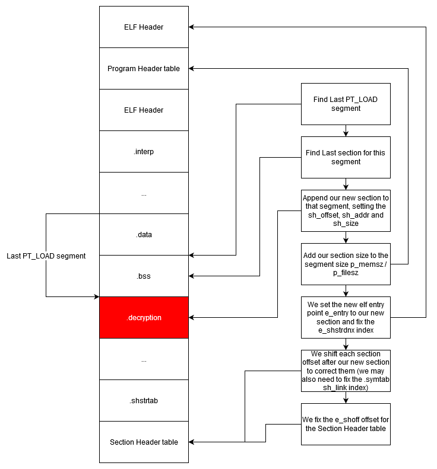
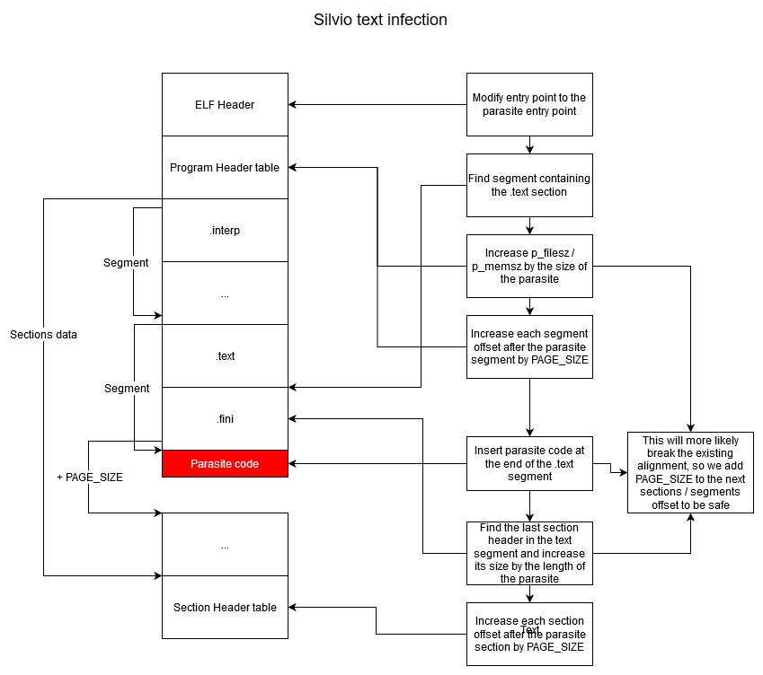
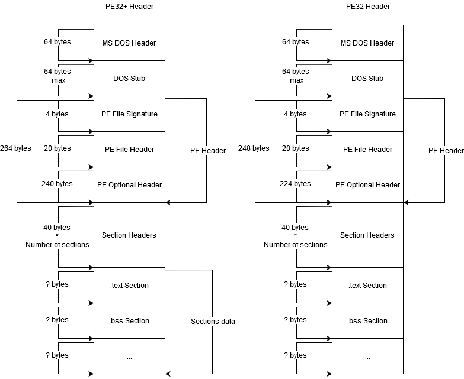
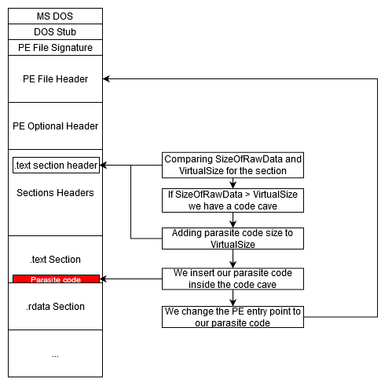

This is a very basic explanation of the different file format structures and how does the different encryption methods used by Silent_Packer work.

# ELF

> In computing, the **Executable and Linkable Format** (ELF, formerly named Extensible Linking Format), is a common standard file format for executable files, object code, shared libraries, and core dumps.

## ELF Structure

## ELF Code cave

**TODO**

## ELF Section Insertion

## ELF Silvio Text Infection

# PE

> The **Portable Executable** (PE) format is a file format for executables, object code, DLLs and others used in 32-bit and 64-bit versions of Windows operating systems. The PE format is a data structure that encapsulates the information necessary for the Windows OS loader to manage the wrapped executable code.

## PE Structure

## PE Code Cave

## PE Section Insertion

**TODO**